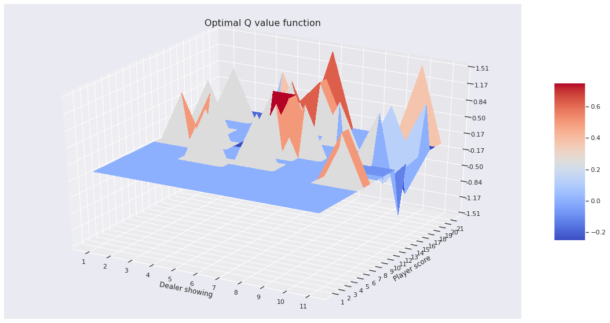
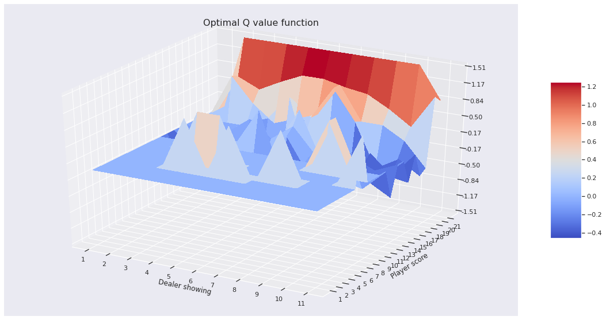
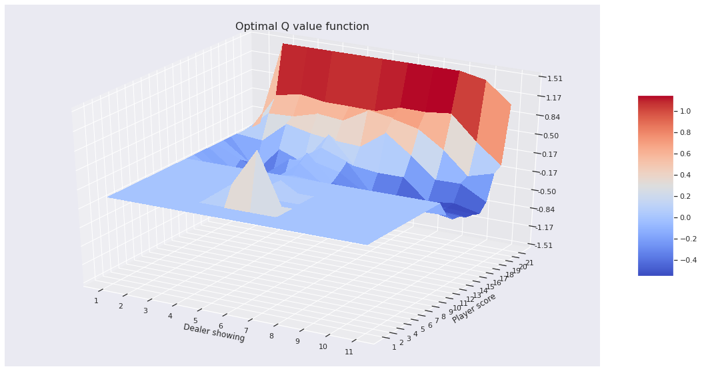
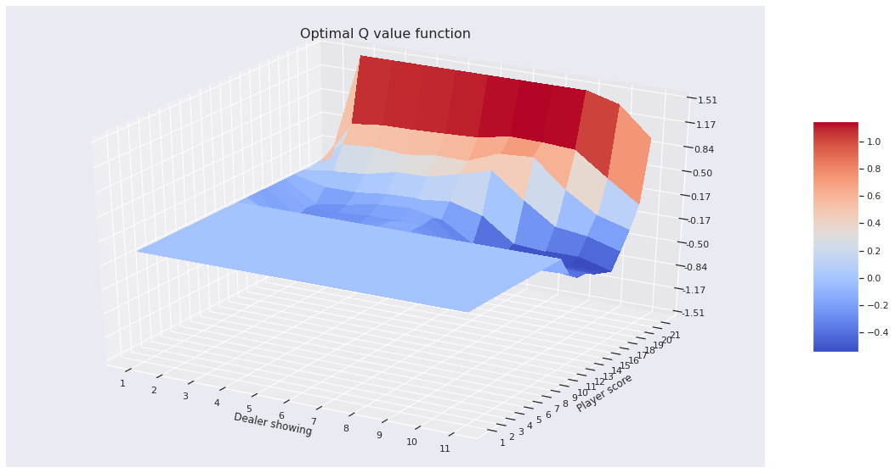
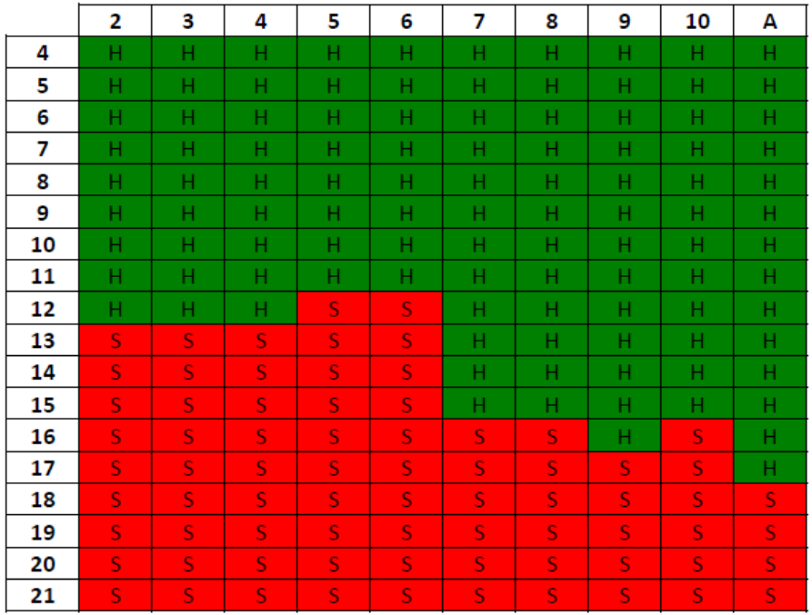

# Reinforcement Learning Blackjack #

For this project, we wanted to experiment with using machine learning to find the optimal way to play a card game. We settled on using the card game Blackjack as it can be reduced to fairly simplistic rules and you can immediately know if a decision (hit or stand) resulted in a positive or negative outcome. This, combined with the fact that there are relatively few states for the player to react to (only 180), made this game a very good candidate to use Q-Learning for.

## What is Q-Learning? ##

Q-Learning is a reinforcement learning algorithm that generates a table the includes the estimated costs of applying each action or policy to that state. This table, called the Q-Value Function, includes estimated costs for every state. We used the Monte-Carlo Control approach to generate and optimize the Q-value function.

## What is the Monte-Carlo Control approach? ##

The Monte-Carlo Control approach to Q-Learning basically means that the model will attempt to find the optimal values for the Q-value function by playing multiple rounds, or episodes, of Blackjack and changing the Q-value function based on the outcome of the episode. For example, if the player hit and won that hand, the Q-value for the hit action at that specific state would increase slightly to represent a favorable outcome happened with that action. Had the player lost instead, the Q-value would be slightly decreased. After several instances of this state being simulated, the Q-value function would indicate the optimal action for that state.

## Setting Up the Environment ##

The first thing we needed to do to build our model was set up our environment for it to learn in. The environment defines all of the rules and constraints for the game. Our version of Blackjack is heavily simplified and follows the following rules:

  - There is no betting in our implementation.
  - Cards are assigned a value equal to their rank.
    - Face cards are worth 10.
    - Aces can be either worth 1 or 11.
  - The Player and the Dealer are dealt 2 cards each.
    - The Player's cards are dealt face up while only one of the Dealer's cards are dealt face up.
  - The Player can choose to **Hit** or **Stand**.
    - If the Player Hits, they are given an additional card. If the sum of their hand is greater than 21, they bust and the Dealer wins the hand.
    - If the Player Stands, their turn ends and it becomes the Dealer's turn.
  - The Dealer must Hit if the value of their hand is less than 17. Otherwise they must Stand. If the Dealer goes over 21, they bust and the Player wins the hand.

## Training the Model ##

The Q-value function is initialized with the starting policy being **Hit**. As more and more episodes are simulated, this policy will change to **Stand** where it is the optimal action.

After simulating all episodes, the resulting Q-value function can be visualized. The below figures show a visualization of the Q-value function after n episodes.

### n = 100 ###

### n = 1,000 ###

### n = 10,000 ###

### n = 100,000 ###

As you can see, as the number of episodes goes up, the smoother and more optimal the Q-value function gets. 

Another way to look at the data for the n = 100,000 graph is shown below.

Like the graph above, this chart shows the optimal action for each state. The difference is that the 3D graph shows the ranges of Q-values and this chart just shows the optimal action. The top axis represents what card the dealer is showing and the left axis represents the Player's hand total. For example, if the Player had a King and a 5 (total value of 15), and the Dealer was showing a 5, the Player would want to Hit.

## Validating Our Model ##

After training our model, we wanted to be able to measure how effective our model was. We looked up the expected percentages for the following metrics:

  - Player Win (42.22%)
  - Player Loss (49.10%)
  - Player Tie (8.48%)

We then took our Q-value functions for n = 100, n = 1000, n = 100000, and n = 1000000 and compared them to the expected odds:

|  Result  | Standard Odds | n = 100 | n = 1,000 | n = 100,000 | n = 1,000,000 |
|:--------:|:-------------:|:-------:|:---------:|:-----------:|:-------------:|
|  **Win** |     42.22%    |  30.96% |   41.16%  |    42.90%   |     42.83%    |
| **Loss** |     49.10%    |  63.62% |   50.93%  |    48.89%   |     48.95%    |
|  **Tie** |     8.48%     |  5.42%  |   7.91%   |    8.21%    |     8.23%     |

What we found out is that our implementation came incredibly close to the expected odds for the optimal way to play Blackjack.

One interesting observation that came out of this table is that, past a certain point, we would get increasingly diminishing returns. The differences in percentages between n = 100 and n = 1,000 are quite significant but the differences between n = 1,000 and n = 1,000,000 are almost negligible even though the difference in the number of episodes are several orders of magnitude larger than the first comparison. This means that, past a certain point, we would end up using more and more computational power for negligible differences in optimality.

## Running Our Code ##

placeholder text